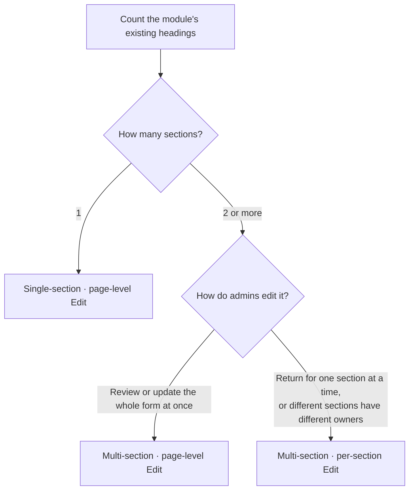
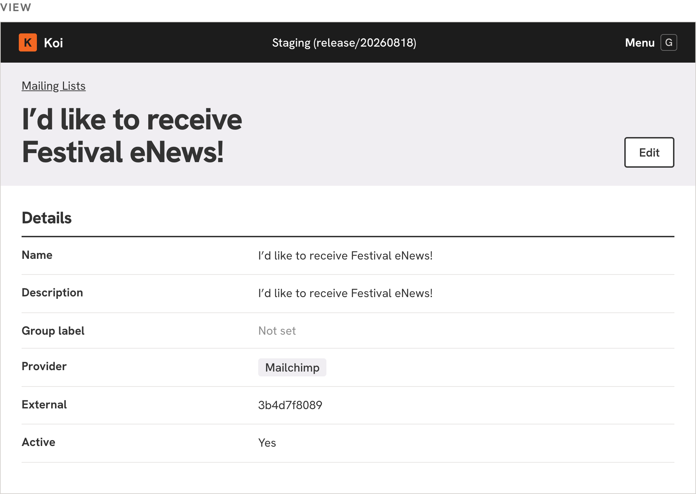
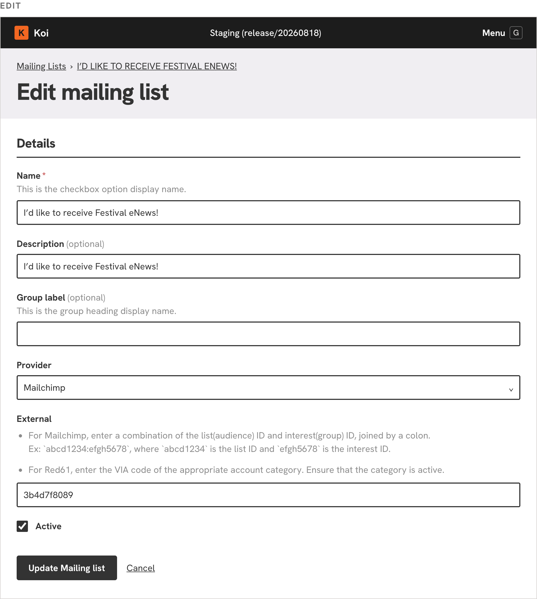
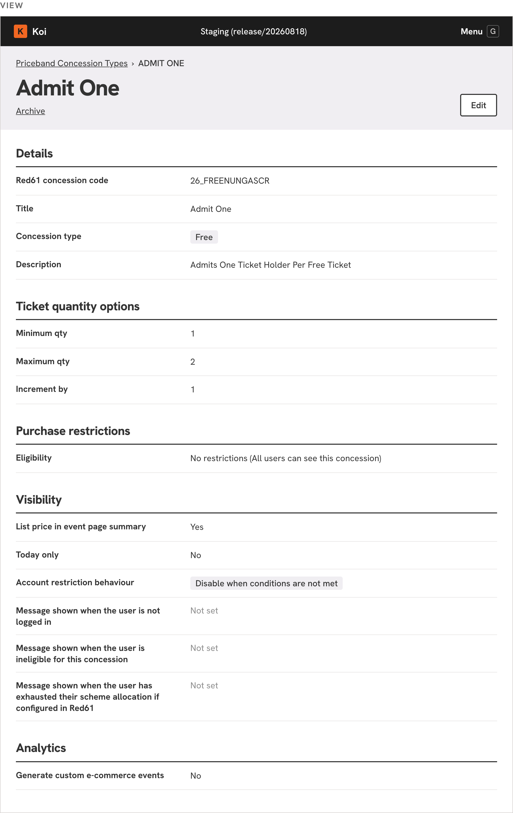
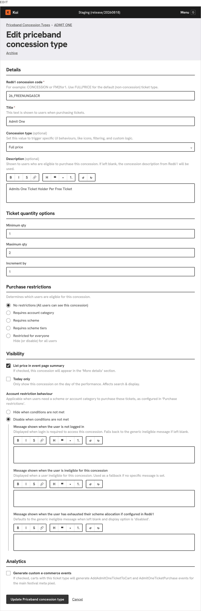
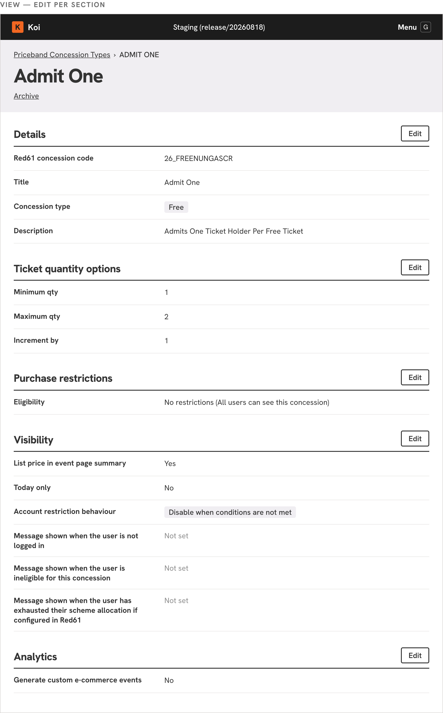
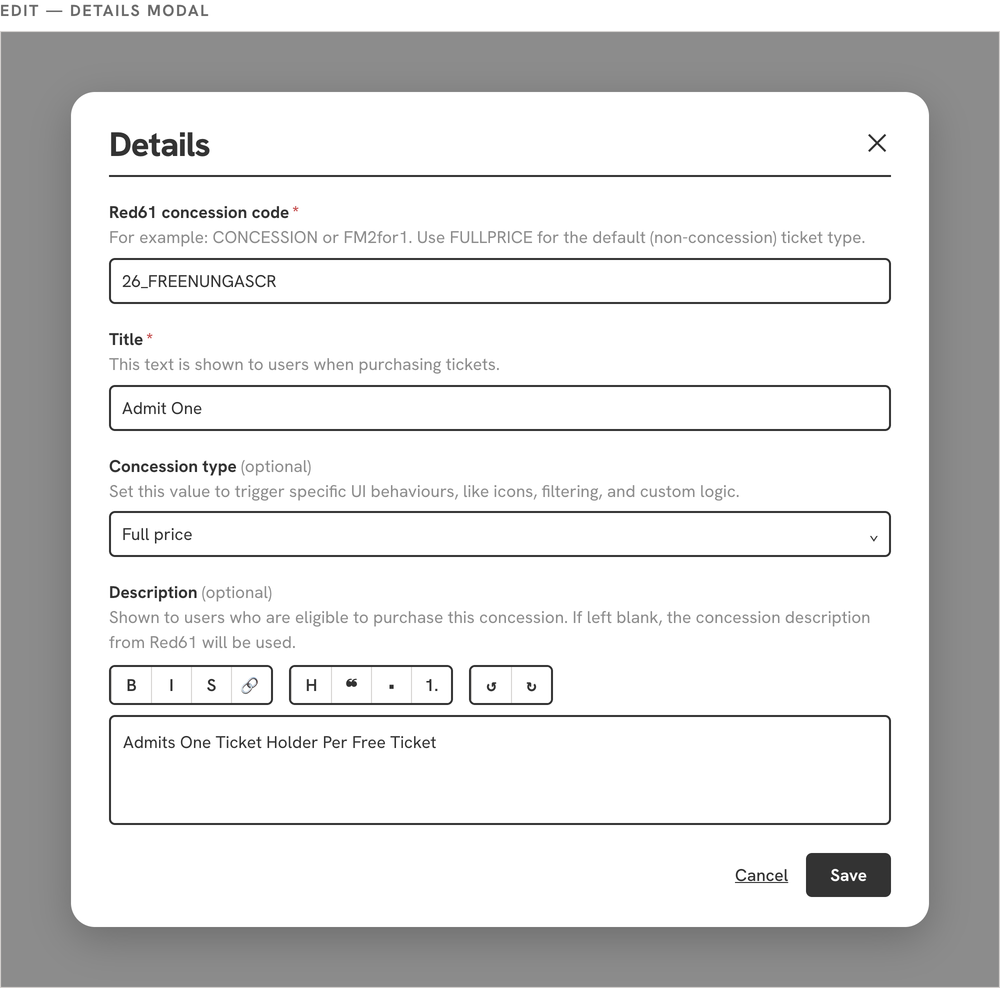

# Form patterns for module view and edit pages

How a Koi module's view and edit pages are structured, and how to choose the right pattern for a module. There are three patterns, all built from the existing Koi components — same header band, section headings, field styles and buttons everywhere. The patterns differ only in how many sections a page has and where the Edit action sits.

The short version: count the headings the module already has. One heading means the single-section pattern. Two or more means multi-section, and how admins edit the module picks between one page-level Edit and per-section Edits.

## Global rules

These hold for every pattern:

1. **A section = a heading the module already has.** Section count comes from the existing show page headings. Regrouping content into different sections is separate work, out of scope here.
2. **View and Edit use the same headings and names.** A section is called the same thing on the show page and on its form, and field labels match in both directions. Where they currently disagree, the show page heading is the canonical one (e.g. "Ticket quantity options", not "Ticket quantity selection").
3. **A group of fields without a heading of its own is titled "Details".** This applies to a single-section module's only group, and to the unnamed first group of a multi-section module.

## Classifying a module

The second question is about admin behaviour, not content. Signals that point to per-section Edits: admins come back after setup to change just one section (tweak a value, fix one line), different people look after different sections, or an accidental change slipping into a whole-form save would be costly. When in doubt, prefer the page-level Edit; the view is identical in both multi-section patterns, so a module can move to per-section Edits later without the show page changing.

## The patterns

### Single-section · page-level Edit

Example: Mailing list.

- **View:** one section titled "Details" (global rule 3), rendered as label/value rows. A single Edit button sits in the page heading band.
- **Edit:** the Edit button opens the whole form on its own page, under the same "Details" heading, with the same field labels as the view rows. One primary submit ("Update …") plus a Cancel link.

Pick for modules with one section. Most Koi modules sit here; this is the existing behaviour, formalised.

### Multi-section · page-level Edit

Example: Priceband concession type.

- **View:** two or more titled sections (Details, Ticket quantity options, Purchase restrictions, Visibility, Analytics), each rendered as label/value rows under its heading. A single Edit button sits in the page heading band.
- **Edit:** the Edit button opens the whole form on its own page, with the same sections in the same order under the same headings. One primary submit for the whole form.

Pick when admins usually return to review or update the form as a whole. Note the whole-form trade-off: every field saves together, so this pattern suits modules where that is acceptable.

### Multi-section · per-section Edit

Example: Priceband concession type.

- **View:** the same sectioned show page as above, but each section heading carries its own Edit button on the right, and there is no page-level Edit.
- **Edit:** a section's Edit opens a scoped form containing only that section's fields, titled with the section's own heading. In the demonstration this scoped form opens as a modal over the show page, with Save and Cancel actions. Saving affects only that section's fields.

Pick when admins usually return to change one section at a time, or when different sections are looked after separately.

<!-- To confirm before merging: the scoped form is shown as a modal in the demo. If the team settles on a separate page (or another container) instead, update the sentence above and re-export the last screenshot — the scoping behaviour is the pattern; the container is an implementation choice. -->

## Edit behaviour at a glance

| Pattern | Edit action | Opens | Saves |
|---|---|---|---|
| Single-section · page-level Edit | One Edit in the page heading band | The whole form on its own page | All fields |
| Multi-section · page-level Edit | One Edit in the page heading band | The whole form on its own page, same sections and headings as the view | All fields |
| Multi-section · per-section Edit | One Edit per section heading | A scoped form for that section only (modal in the demo) | That section's fields only |

## Out of scope

- Visual redesign, including how sections are visually separated (cards, dividers, spacing). These patterns describe structure and behaviour using existing Koi styling.
- A navigation side menu for very long forms. Identified as a later addition; not part of this round.
- Regrouping module content into different sections.
