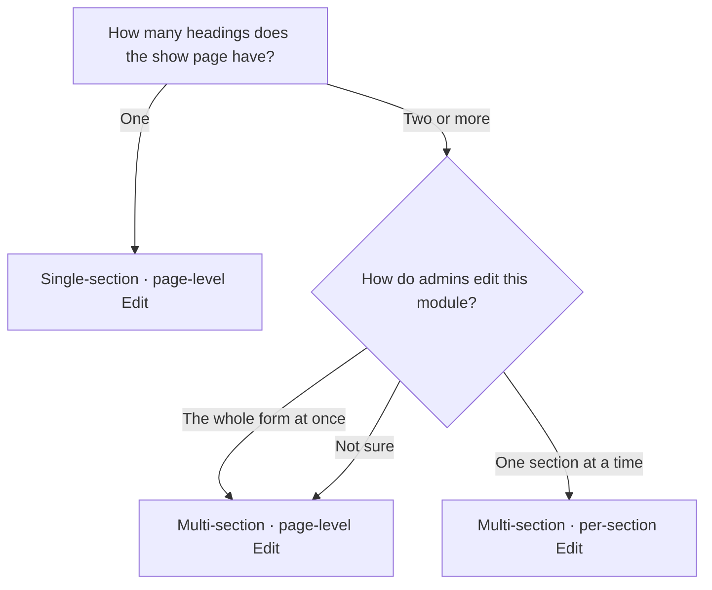
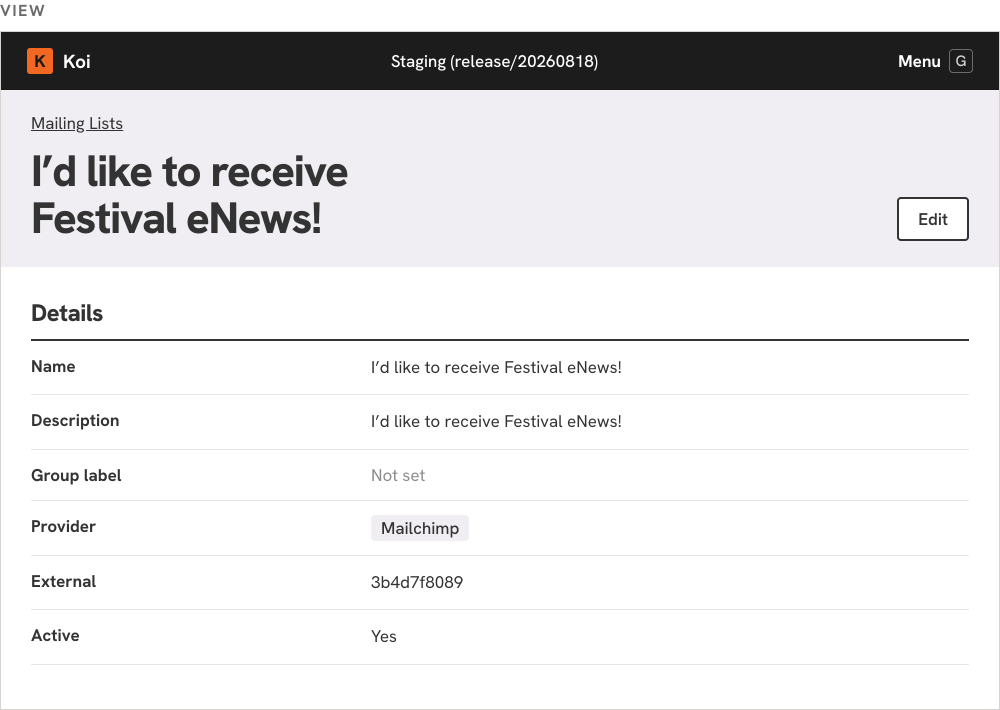
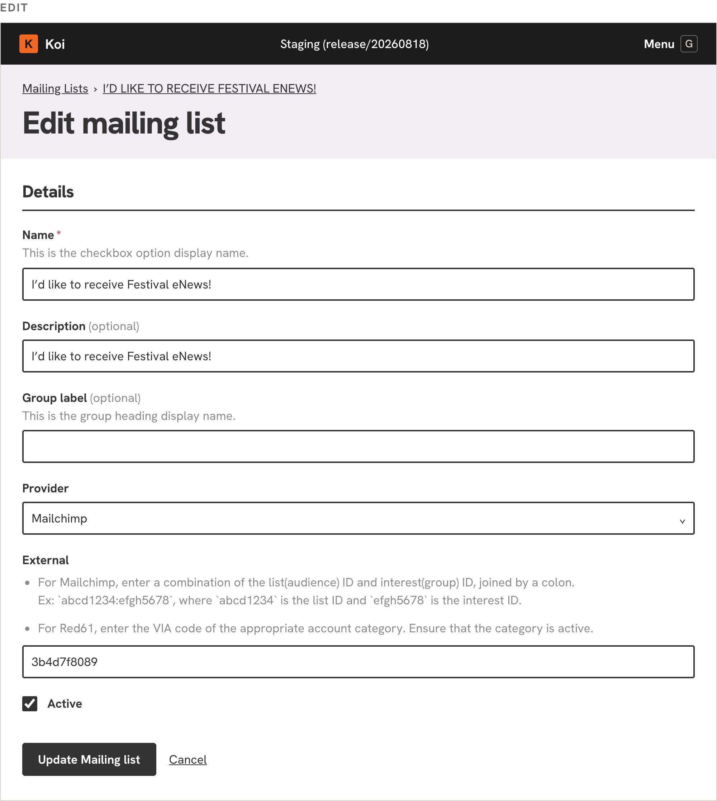
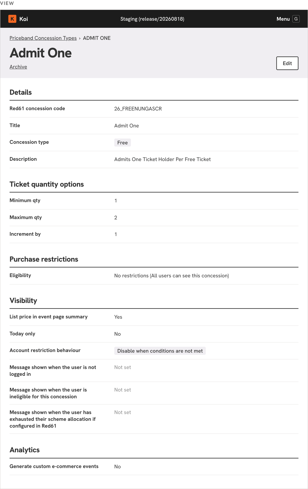
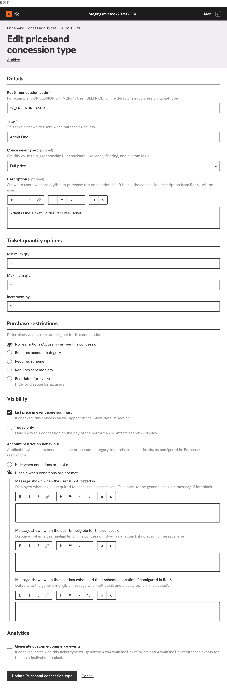
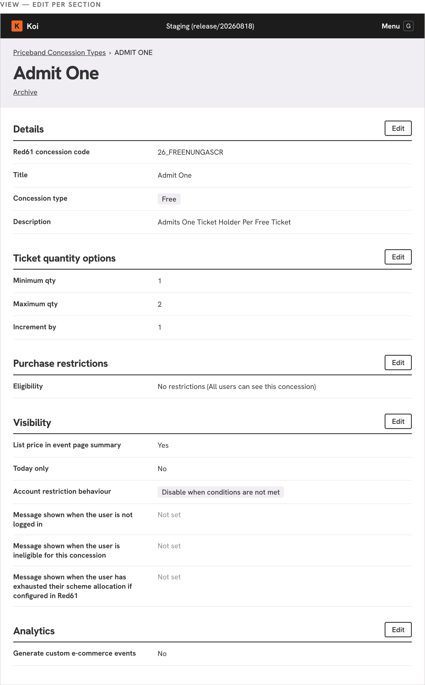
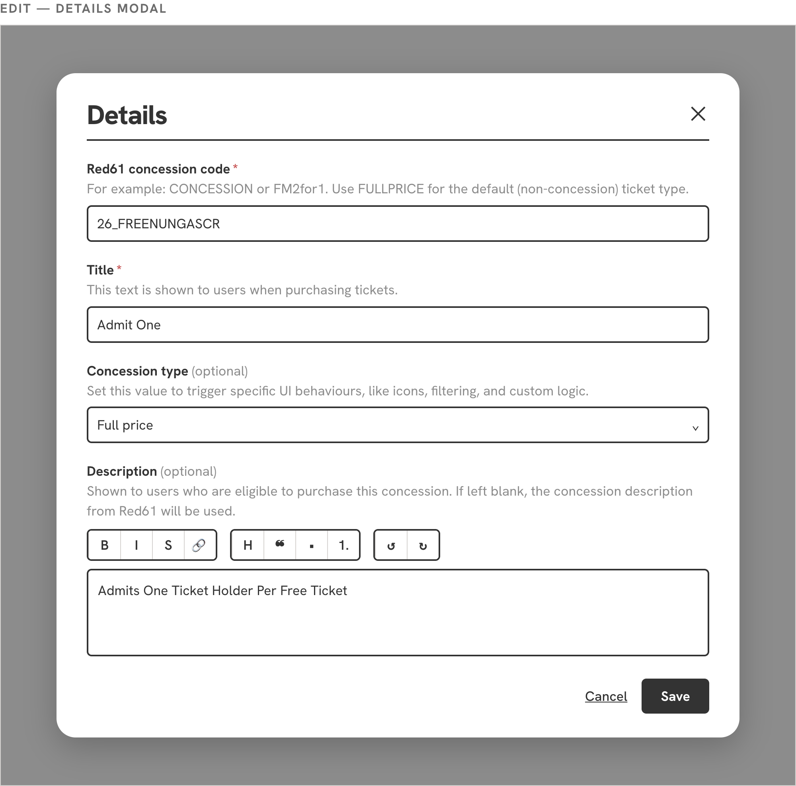

# Structuring a Koi module's view and edit pages

Your module's content is grouped under headings, but on the page it doesn't look that way: the show page reads as one long run of rows, and editing means opening one long form no matter how small the change. This guide shows three ways to present the sections a module already has, so the grouping is obvious on the page and the way admins edit matches the way they actually work. It helps you pick one per module.

Everything here is built from the components Koi already has: the same header band, section headings, fields and buttons you see across the admin. You're choosing a structure, not building new UI.

**If you're looking into how a form's content should be better grouped** (which fields belong together, what the headings should be), this document doesn't cover that. It assumes the module's fields are already grouped under headings that make sense.

## Two habits that make every pattern work

**Count sections by the headings you already have.** When this guide says "section", it means a heading on the module's show page. One heading (or none) means a single-section module; several headings mean a multi-section module. If a group of fields has no heading of its own, title it "Details".

**Keep the view and the edit form matching.** Call a section the same thing on the show page and on its form, and use the same field labels in both places. If the two disagree today, use the show page's wording (for example, the show page says "Ticket quantity options", so the form should too). This is what lets an admin move between viewing and editing without re-orienting.

## Which pattern do I need?

```mermaid
flowchart TD
    A[How many headings does the show page have?] -->|One| B[Single-section · page-level Edit]
    A -->|Two or more| C{How do admins edit this module?}
    C -->|The whole form at once| D[Multi-section · page-level Edit]
    C -->|One section at a time| E[Multi-section · per-section Edit]
    C -->|Not sure| D
```

The second question is about people, not fields. Do admins open this module to work through the whole thing, or do they come back to change one section (fix a value, update one group) and leave? Ask whoever knows how the client's admins work, if you can.

> [!TIP]
> **Not sure how admins edit it? Start with the page-level Edit.** The show page looks identical in both multi-section patterns, so a module can move to per-section Edits later without the view changing. You are not locking anything in.

## Single-section · page-level Edit

Example: Mailing list.

- **When to use it:** the module has one section. Most Koi modules sit here. This is the existing behaviour, written down.
- **The view:** one section titled "Details", shown as label/value rows, with a single Edit button in the page heading band.
- **Editing:** Edit opens the whole form on its own page, under the same "Details" heading, with the same field labels as the view. One "Update …" button, plus Cancel.

<table>
<tr><th>View</th><th>Edit</th></tr>
<tr>
<td></td>
<td></td>
</tr>
</table>

## Multi-section · page-level Edit

Example: Priceband concession type.

- **When to use it:** the module has several sections, and admins usually work through the form as a whole, reviewing or updating everything in one sitting.
- **The view:** each section under its own heading, shown as label/value rows. One Edit button in the page heading band.
- **Editing:** Edit opens the whole form on its own page, with the same sections in the same order under the same headings. One "Update …" button for everything.
- **Worth knowing:** every field saves together. That's fine for most modules, but if an accidental change slipping through with a save would be costly, look at per-section Edits below.

<table>
<tr><th>View</th><th>Edit</th></tr>
<tr>
<td></td>
<td></td>
</tr>
</table>

## Multi-section · per-section Edit

Example: Priceband concession type.

- **When to use it:** the module has several sections and admins come back for one of them at a time, or different people look after different sections.
- **The view:** the same sectioned show page as above, but each section heading carries its own Edit button, and there's no page-level Edit.
- **Editing:** a section's Edit opens a small form containing just that section's fields, titled with the section's own heading. Saving changes only that section; the rest of the record can't be touched by accident.

<table>
<tr><th>View</th><th>Edit (modal)</th></tr>
<tr>
<td></td>
<td></td>
</tr>
</table>

### Modal or a separate page? (not settled yet)

The design intent behind this pattern is to keep the show page in view while editing one piece of it. There are two ways to open the scoped form:

- **A modal** (what the screenshots show): keeps the show page visible behind the edit, and matches how Koi handles this today (Content pages and news work the same way). The original proposal was a slide-in panel; the modal is the closest thing Koi already has.
- **A separate page:** gives the form more room, and matches how the other two patterns edit.

Until this is settled (with Jason), treat the *scoping* as the pattern (one section's fields, saved alone) and the container as an open choice. If you're building this pattern now, raise it before committing to one.

## The three patterns at a glance

| Pattern | Edit action | Opens | Saves |
|---|---|---|---|
| Single-section · page-level Edit | One Edit in the page heading band | The whole form on its own page | All fields |
| Multi-section · page-level Edit | One Edit in the page heading band | The whole form on its own page, matching the view | All fields |
| Multi-section · per-section Edit | One Edit per section heading | A small form for that section only | That section's fields only |
