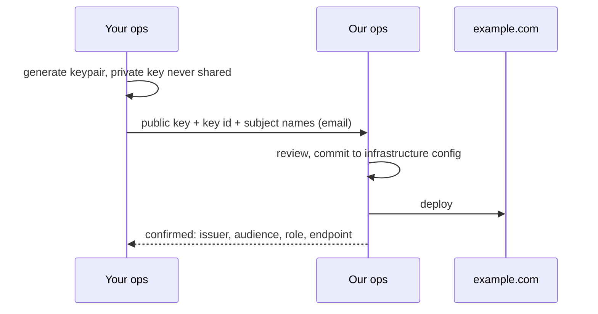
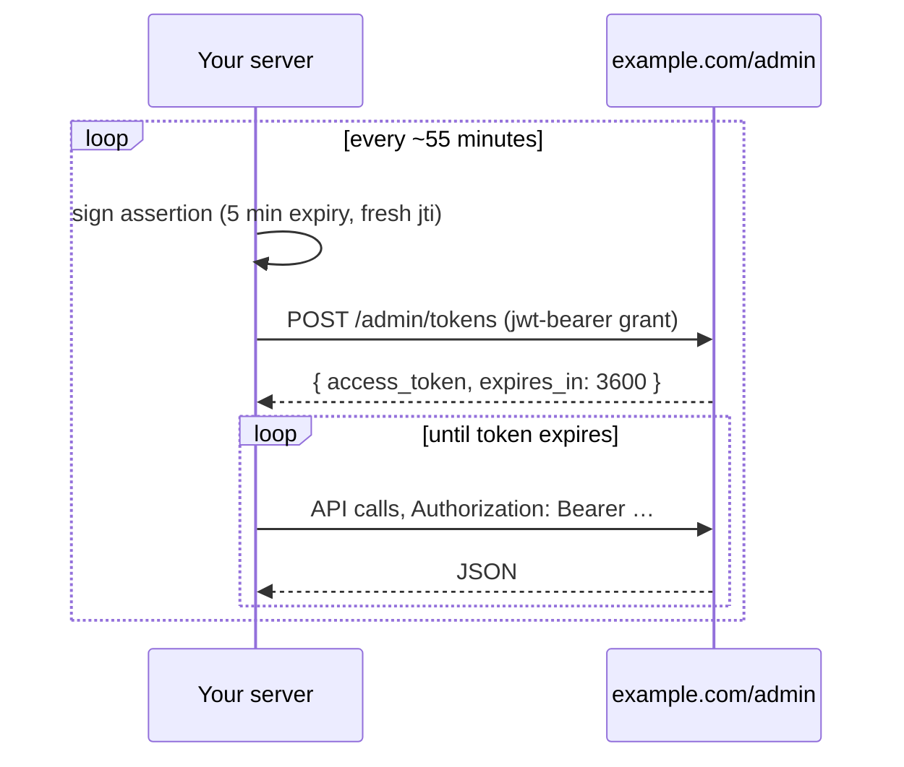

# Integrating with the Koi admin API

A walkthrough for third-party systems authenticating to a Koi-powered admin
API with a pre-shared public key. Examples use
`https://example.com/admin` and an imaginary integrating service named
Komet — swap in your own site and the integration name you agree with our
ops during onboarding.

The short version: you hold a private key, we hold the matching public key.
You sign a short-lived assertion, exchange it for a bearer token, and use
that token for about an hour. No passwords, no API keys, nothing sensitive
ever crosses the wire or sits in a config file on our side.

## Onboarding

Generate a keypair. The private key is yours: store and manage it under your
own secrets policies — the only thing that matters to us is that you never
send it. Nothing you share with us is secret.

```sh
openssl ecparam -name secp384r1 -genkey -noout -out komet-private.pem
openssl ec -in komet-private.pem -pubout -out komet-public.pem

# base64-encode for your ENV / secrets manager, then discard the files
base64 < komet-private.pem   # → KOMET_PRIVATE_KEY
base64 < komet-public.pem    # → KOMET_PUBLIC_KEY
```

Send us three things (email is fine — none of this is secret):

1. The public key (the `KOMET_PUBLIC_KEY` value as-is is fine)
2. A key identifier of your choosing, e.g. `komet-2026-07`
3. The subject name your integration will authenticate as, e.g.
   `komet-production`

We'll agree on the subject name, register the key, and confirm
back your **issuer** (`komet`), your **audience**
(`https://example.com/admin`), and the role your tokens will carry.
Registration lands when we update our server configuration and deploy.



## Authenticating

Two steps, repeated roughly hourly, per server:
sign an assertion, exchange it for a bearer token.



### 1. Sign an assertion

A JWT signed with your private key. Keep the expiry at five minutes or less,
generate a fresh `jti` every time (they're single-use), and put your key id
in the header.

```ruby
require "base64"
require "jwt"
require "securerandom"

private_key = OpenSSL::PKey.read(Base64.decode64(ENV.fetch("KOMET_PRIVATE_KEY")))

now = Time.now.to_i
assertion = JWT.encode(
  {
    iss: "komet",
    sub: "komet-production",
    aud: "https://example.com/admin",
    iat: now,
    exp: now + 300,
    jti: SecureRandom.uuid,
  },
  private_key,
  "ES384",
  { kid: "komet-2026-07" },
)
```

### 2. Exchange it for a bearer token

```sh
curl -sS -X POST https://example.com/admin/tokens \
  -H "Accept: application/json" \
  -d "grant_type=urn:ietf:params:oauth:grant-type:jwt-bearer" \
  -d "assertion=$ASSERTION"
```

```json
{
  "access_token": "eyJ…",
  "token_type": "Bearer",
  "expires_in": 3600
}
```

Cache the token and reuse it until shortly before `expires_in` elapses. Mint
an assertion per exchange, not per request — one assertion, one token, many
API calls.

### 3. Call the API

```sh
curl -H "Authorization: Bearer $ACCESS_TOKEN" \
     -H "Accept: application/json" \
     https://example.com/admin/pages
```

```sh
curl -X PATCH https://example.com/admin/pages/42 \
     -H "Authorization: Bearer $ACCESS_TOKEN" \
     -H "Content-Type: application/json" \
     -d '{"page": {"title": "About us"}}'
```

Your token carries the role we agreed at onboarding (for Komet that's page
editing), so expect 403s outside that surface. Every call is attributed to
your subject name in our audit logs.

A minimal client:

```ruby
class KoiClient
  BASE = "https://example.com/admin"

  def token
    @token = fetch_token if @token.nil? || @expires_at < Time.now + 60
    @token
  end

  private

  def fetch_token
    response = Net::HTTP.post_form(
      URI("#{BASE}/tokens"),
      "grant_type" => "urn:ietf:params:oauth:grant-type:jwt-bearer",
      "assertion"  => sign_assertion, # as above
    )
    body = JSON.parse(response.body)
    @expires_at = Time.now + body.fetch("expires_in")
    body.fetch("access_token")
  end
end
```

## When things go wrong

The token endpoint answers `400 {"error": "invalid_grant"}` for any
rejected assertion, deliberately without detail. Work through this list:

| Check | Common cause |
|---|---|
| Server clock | `exp` already passed on arrival — sync NTP |
| `exp` | Missing, or more than an hour away — keep it ≤5 minutes |
| `aud` | Must be exactly `https://example.com/admin` |
| `kid` header | Must match the key id you registered |
| `jti` | Missing or reused — generate a fresh UUID per assertion |
| `sub` | Doesn't exactly match the agreed subject name |

On API calls, a `401` means your token expired or was revoked — exchange a
new assertion and retry. A `403` means the token is fine but the endpoint is
outside your role. `429` on the token endpoint means you're exchanging too
often; cache the token.

## Key rotation

Generate a new keypair, send us the new public key with a new key id
(`komet-2026-12`), and keep signing with the old key until we confirm the new
one is live. Both keys work during the overlap — the `kid` header picks the
right one — then we drop the old key. Same channel, same turnaround.

If a private key is ever compromised, tell us immediately: we remove the key
and kill any outstanding tokens within minutes.

## Checklist

- [ ] Keypair generated; private key secured under your own secrets policies
- [ ] Public key, key id, and subject names sent to our ops
- [ ] Confirmation received: issuer, audience, role
- [ ] Assertion signing implemented (ES384, ≤5 min expiry, fresh `jti`, `kid` header)
- [ ] Token cached and refreshed before expiry
- [ ] `401` → re-exchange; `429` → check your token cache
- [ ] Rotation calendar note before your key's planned retirement
