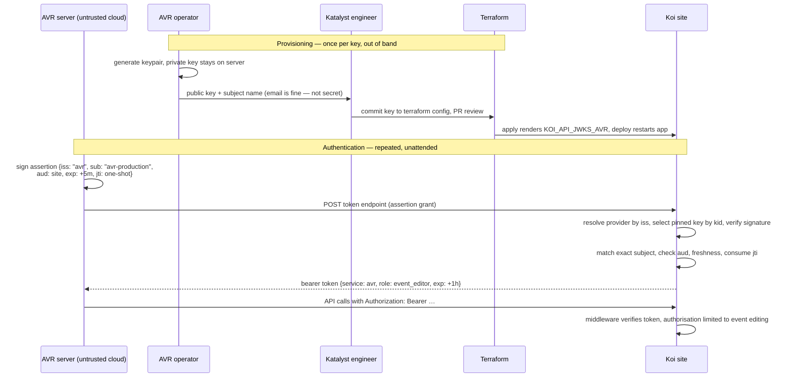
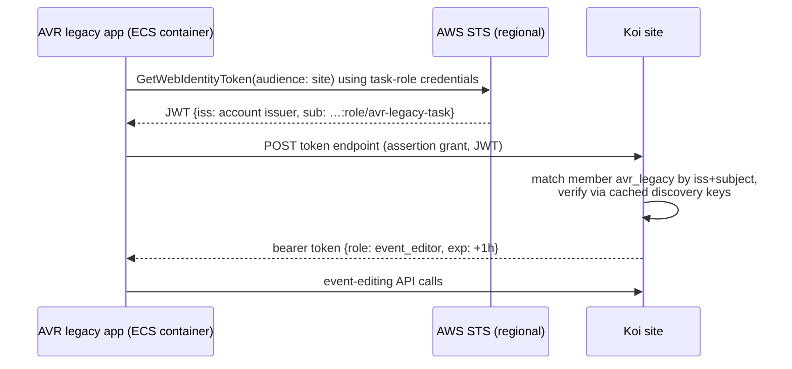
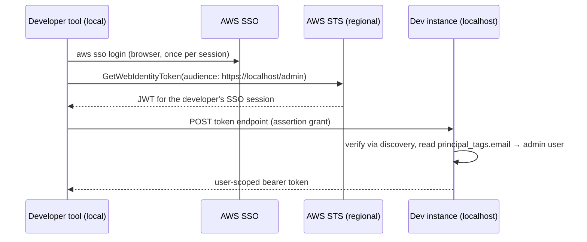

# Password-less API authentication

Unattended API access to Koi sites without passwords or long-lived shared
secrets. The core flow — the `identity` trust config, assertion
verification, the jwt-bearer grant, user- and role-scoped issuance, OIDC
discovery, and read-only admin visibility — is implemented and verified
live on a deployed site across all three trust shapes: user-scoped via a
production AWS issuer, role-scoped via a developer AWS identity, and a
pinned certificate-based partner. The guide for integrating partners is
[api-partner-integration.md](api-partner-integration.md); background on
Koi's other mechanisms and the alternatives considered is in the
[appendix](#appendix-background-and-alternatives-considered).

## The design

One token endpoint, one trust registry, one proof type, short-lived bearer
tokens. A caller proves who it is with a **signed assertion**: a JWT carrying
issuer, subject, audience, and expiry claims, signed by a private key Koi
never holds. Koi verifies the signature against trusted public keys, checks
the claims against per-service trust rules, and mints a short-lived bearer
token that the existing authentication middleware already accepts. Trust
*rules* change only by deploy; key *material* comes from one of two sources
per service (see below).

Assertions come from three kinds of signer, all verified identically:

- **Ad-hoc partners** (e.g. AVR servers): the partner generates a keypair,
  sends us the public key out of band, and self-issues assertions.
- **OIDC platforms** (e.g. GitHub Actions): the platform issues its workloads
  identity tokens and publishes verification keys at a well-known HTTPS
  location derived from the issuer URL.
- **AWS principals**: since November 2025, AWS IAM Outbound Identity
  Federation lets any permitted principal call `sts:GetWebIdentityToken` and
  receive a JWT signed by AWS, verifiable against an account-specific issuer
  with standard OIDC discovery endpoints. SSO engineer sessions, ECS task
  roles, and local developer sessions all become ordinary OIDC assertions —
  no AWS-specific verification path exists in Koi.

### (a) Trust rules — `config/koi.yml`

Environment-scoped declarative configuration, loaded via `config_for` at
boot so that AWS trust is shared across all environments while AVR
differs between staging and production. Koi
already loads `config/koi.yml` into `Koi.config`; trust config lives under a
dedicated `identity:` section, exposed as `Koi.config.identity`, with two
namespaces: `providers` (issuers we accept assertions from — verification
only) and `members` (named trust rules: who may authenticate, and what they
become). Illustrative shape:

```yaml
shared:
  identity:
    providers:
      # Verification only — who can sign. What a verified principal may
      # become is declared under members.
      aws:
        # account-specific issuer, from GetOutboundWebIdentityFederationInfo;
        # neither issuers nor subjects are secret.
        issuer: https://a1789190-8dcb-4973-9aae-7acf5c30ee9f.tokens.sts.global.api.aws
        keys: discover                             # OIDC discovery from the issuer

    members:
      # Katalyst engineers: the token acts as the matched admin. The subject
      # is the exact SSO permission-set role ARN — it gates who may
      # authenticate and carries no email; identity comes from
      # admin-controlled tags (see "User mapping" below).
      engineers:
        provider: aws
        scope: admin/user
        subject: arn:aws:iam::123456789012:role/aws-reserved/sso.amazonaws.com/ap-southeast-2/AWSReservedSSO_Engineer_0123456789abcdef

production:
  identity:
    providers:
      avr:
        issuer: avr
        keys: env                                  # pinned: KOI_API_JWKS_AVR
    members:
      # Members merge by name across shared/environment sections: these add
      # to the shared engineers entry rather than replacing it.
      avr:
        provider: avr
        scope: admin/role/event_editor
        subject: avr-production
      avr_legacy:
        provider: aws
        scope: admin/role/event_editor
        # an ECS task-role sub is a bare role ARN (no assumed-role/task-id
        # segment)
        subject: arn:aws:iam::123456789012:role/avr-legacy-task

staging:
  identity:
    providers:
      avr:
        issuer: avr
        keys: env
    members:
      avr:
        provider: avr
        scope: admin/role/event_editor
        subject: avr-staging
```

Semantics:

- **Providers verify; members authorize.** A provider is an issuer and its
  key material — one entry per issuer, resolved from the assertion's `iss`.
  What a verified principal may *become* is declared by named members, each
  pairing a provider and an exact subject with a scope — so one issuer (an
  AWS account) serves engineers acting as admins and task roles acting as
  machines without duplicating trust entries. Members merge by name across
  `shared:` and environment sections, so an environment adds trust without
  restating what it inherits; the name is a config handle — the merge key
  and how the roles page labels a grant — while attribution records the
  provider and subject.
- **Subjects are exact, and matched after verification.** A verified
  assertion's `(provider, sub)` pair must match a member — none is a
  rejection; should several members declare the same subject, the first
  declared wins. The subject gates *which principal* may authenticate (a
  specific SSO permission set or task role) and is what audit attribution
  records. Pattern or wildcard matching is
  deliberately absent until an integration concretely needs it. The subject
  does not carry identity: an AWS-issued `sub` is a bare role ARN with no
  email.
- **Verification is one `JWT.decode`.** The provider supplies the policy the
  library enforces: an asymmetric-only algorithm allowlist (per-provider
  override available; unsigned tokens and HMAC key-confusion are rejected by
  construction), its key set as the library's JWKS loader, the expected
  audience, a required expiry no more than an hour out (assertions are
  exchanged immediately, so a distant expiry is a misconfiguration minting
  long-lived credentials), 15 seconds of clock leeway, and single-use `jti`
  consumption backed by the shared cache, scoped per issuer. Every
  assertion must carry a fresh `jti` — platform tokens included. The library's typed errors are
  the rejection taxonomy; the endpoint collapses them all to an opaque
  `invalid_grant`.
- **The expected audience is the requesting site.** By default a token must
  name `{base_url}/admin` of the request it is exchanged on — trusting the
  request host is sound because Rails host authorization
  (`config.host_authorization`) is part of the standard deploy. A provider
  may pin `audience:` explicitly (for tokens not minted for the serving
  host), and verification fails closed when no expected audience exists —
  the JWT library would otherwise skip the check entirely for a nil
  audience.
- **The member's scope names the actor.** `scope: admin/user` makes the
  token act as the matched admin; `scope: admin/role/<slug>` makes it act
  as that machine role (see
  [Machine actors](#machine-actors-assumable-roles)). The grammar is
  `<actor model path>[/<instance>]` — the type segment is the underscored
  actor class (`admin/user` → `Admin::User`), dispatched through an
  allowlist, never constantized. `admin/user` carries no instance segment
  because identity comes from the claims; `admin/role/<slug>` names its
  instance because identity comes from config.
- **User mapping reads admin-controlled identity claims.** The principal is
  one flat shape — provider, subject, scope, plus optional `name` and
  `email` — and identity extraction is keyed by issuer when the principal is
  built: AWS issuers lift `principal_tags` (`email`, `name` — populated by
  Identity Center attribute mapping) into those fields. An `admin/user`
  member matches the principal's email against `Admin::User#email` via the
  model's normalization, excluding archived admins. Identity never comes
  from caller-chosen claims (`request_tags`) or the subject; a principal
  whose issuer lifts no email can never match an admin. Role members need
  no identity mapping.
- **Config errors fail boot.** The trust registry is validated on every
  boot and reload (`to_prepare` constructs the providers and members):
  entries are POROs with model validations — providers must be
  well-formed, pinned key sets must parse from their `KOI_API_JWKS_*`
  variable, and every member must name a declared provider and an
  allowlisted scope. The mistakes this catches would otherwise be silently
  inert (a member that can never match); each instead fails the deploy
  with an error naming the offender. Validation reads config and ENV — no
  database, no discovery HTTP. Provider entries are additionally validated
  when materialized for a verification, so drift after boot still fails
  the exchange that touches it with a hard error — never a silent no-op.

### (b) Key material — pinned or discovered

Each service declares where its verification keys come from:

- **`keys: env` — pinned.** The service reads a JSON key set from
  `KOI_API_JWKS_<SERVICE>` (service name upcased); a missing or
  unparseable set fails boot. For ad-hoc partners the
  keys are committed to Terraform config and reviewed as a PR (public keys
  are not sensitive). Every key carries a `kid`; overlapping keys during
  rotation resolve unambiguously. Changing keys is a deploy — appropriate
  for partners whose keys change rarely and deliberately.
- **`keys: discover` — OIDC discovery.** The issuer URL must be HTTPS; Koi
  fetches `{issuer}/.well-known/openid-configuration`, follows it to the
  key set, and caches the result in the shared Rails cache for one hour.
  The discovery response must name the configured issuer (mix-up defence) —
  only the issuer's own keys are ever trusted. An assertion presenting a
  `kid` missing from a cached set older than the invalidation grace (five
  minutes) busts the cache and refetches — so a rotated-in key is honoured
  within minutes, a removed key survives at most the TTL, and a stream of
  garbage `kid`s cannot force a refetch per request. Fetch failure fails
  closed:
  that provider's exchanges are rejected until its issuer is reachable —
  expired cache entries are never served, and other providers are
  unaffected. Issuer key rotation is thus absorbed automatically —
  appropriate for platforms (GitHub, AWS accounts) that rotate on their own
  schedule. This is the one deliberate runtime egress in the design: HTTPS
  to an issuer URL that is itself pinned in reviewed config, so a
  compromised cache can never *widen* trust beyond the configured issuer,
  audience, and subject rules.

Terraform's role narrows to what it is good at: enabling outbound federation
on our AWS accounts (the `aws_iam_outbound_web_identity_federation` resource,
which returns each account's issuer URL — stable per account, so it is
committed directly into `config/koi.yml` rather than threaded through ENV),
configuring Identity Center attribute mapping so an engineer's email rides
in `principal_tags.email`, rendering pinned key sets for ad-hoc partners,
and managing the IAM policies that grant `sts:GetWebIdentityToken` with
audience/duration condition keys (e.g. engineers may only mint tokens whose
audience is one of our sites). A principal outside those grants — another
AWS account included — cannot mint tokens for our sites; verified by hand.

### (c) Koi admin visibility — read-only

`/admin/admin_roles` is the trust surface. The index materializes every
granted role and lists each row: slug, when it materialized, when it last
authenticated
(token issuance — requests made with an outstanding token never touch the
row), and whether it is orphaned (declared once, since removed from
config; the row is retained for history). A role's show page details its
trust: every member granting the role — subject and provider — with the
provider's verification detail (issuer, key source; pinned providers show
key fingerprints, discovered providers their cached fingerprints and fetch
time). Rendering may prime the discovery cache — the same fail-closed path
verification uses — and an unreachable issuer reports itself on the page
rather than erroring. Strictly read-only — changing
trust is a config change and deploy, and revoking a role's outstanding
tokens is a rare, operator-level action: touch `tokens_revoked_at` from
the console. The page requires an admin session (bearer tokens are
refused), and answers "what can act as this role, and how is it
verified?" without reading Terraform or YAML.

User-scoped trust (`admin/user` members) deliberately has no UI: it is
largely orthogonal to the questions asked about roles, and its
authoritative record is the reviewed config, validated at boot.

### Issued tokens

The token endpoint — `POST /admin/tokens`, the jwt-bearer grant beside the
existing device-code grant — issues tokens through the same primitive as
the device flow: each successful exchange records a consumed grant bound to
its actor — the matched admin for `admin/user` members, the materialized
role for `admin/role/<slug>` members — and returns its `api_access` bearer
token. Every issued token — assertion-grant and device-flow alike — lives
one hour, the lifetime of the token definition itself; clients re-exchange
rather than hold long-lived credentials. The middleware's bearer path
authenticates the grant's actor (`Koi::Current.actor`), every grant leaves
an auditable record (requesting IP, user agent, actor), and the issued
token's TTL is independent of the assertion's (AWS proofs can live for
seconds; the issued token still lives its hour).
Role-scoped issuance shares the same grant record: the admin-user reference
is optional, a role reference sits beside it, and an approved grant
belongs to exactly one of the two (pending device-flow grants have neither
until approval; holding both is forbidden at the database). The token's
revocation claim comes from the actor — the user's sign-in time or the role
row's `tokens_revoked_at` — so signing in again invalidates a user's
outstanding tokens, and touching the role row invalidates a role's.

Bearer tokens of either scope stop at session-only surfaces: admin,
profile, and credential management require a cookie session and answer
token-authenticated requests with `403` — the deliberately coarse surface
boundary ahead of the permissions model, and the promised distinction
between `401` (bad token) and `403` (good token, wrong surface).

Assertions are ephemeral, so every grant also records a snapshot of the
verified principal, serialized by the principal itself: provider, subject,
and scope, plus the optional identity fields (`name`, `email`) lifted from
admin-controlled claims — so a role assumed by a person stays attributable
to them. The snapshot is written at issuance and read-only thereafter; it
rehydrates into a principal for attribution on later requests —
`Koi::Current.principal`, request logs, and the admin pages can name
"`event_editor`, assumed by `avr-production`" long after the assertion is
gone. Attribution reaches logs as data, not messages: the controller
appends the stored principal's provider and subject to the request's
`process_action` payload (`append_info_to_payload` — pure Rails
instrumentation), where structured loggers emit them as fields on the
per-request event. No separate log line per authenticated request, and no
coupling to any logging gem.

## Machine actors: assumable roles

Role-scoped tokens need something to act *as* — an entity the future
permissions model can bind to and audit records can point at. Two shapes
were considered and rejected:

- **Reusing admin users** (the service-account pattern): every existing
  attribution mechanism would work for free, but the user model is
  saturated with authentication affordances — passwords, passkeys, OTP,
  reset flows, sign-in by email — that a machine identity must be carefully
  fenced out of. The fencing costs more than the reuse saves, and a machine
  user reachable by password reset is a standing hazard.
- **Memory-only roles** (pure config, ActiveModel): matches the koi.yml
  philosophy, but fails on traceability. Attribution needs a foreign key
  that survives renames; sessions and tokens are rows and cannot belong to
  an object that evaporates at boot; and revocation wants server-side state
  to flip.

The chosen shape is an **assumable role**, AWS-style: an `Admin::Role`,
sitting parallel to `Admin::User`. A role has no authentication principal —
nothing signs in *as* it, it is only ever assumed via a trust entry — but
sessions and tokens belong to it, and the anticipated permissions model (a
coarse none/read/write/all default plus per-module overrides) hangs off the
same entity.

**Config is the source of definition; the database is the source of
identity.** Roles are declared by the members that grant them: a role
exists when some member's scope names it (`admin/role/<slug>`), and the
declared set is the union of granted slugs — no separate declaration until
the permissions model wants per-role config. A member naming an undeclared
provider fails boot like any other config error — a pure config check, no
database involved. The database row, keyed by a stable slug, is what
sessions, tokens, and audit records reference.

- **Materialization is lazy.** Boot performs no database work. The first
  time a role is accessed through the registry — typically first token
  issuance — the row is created or found (create-first against the unique
  slug index, race-safe because roles are never deleted). Test runs, `assets:precompile`, and unrelated rake tasks
  never touch the database for roles. What lazy materialization implies for
  the config schema is deliberately deferred (see unknowns).
- **Sync never deletes.** A role removed from config stops being assumable
  immediately — config is authoritative for what may be granted — but its
  row and history remain, flagged as orphaned in the admin UI. A renamed
  slug is a new role; history stays with the old row.
- **Revocation lever.** Issued tokens embed a claim sourced from the role
  row (`tokens_revoked_at`); touching that timestamp — a console
  operation — instantly invalidates every outstanding token for the role,
  the machine analogue of the sign-in-time invalidation that user tokens
  already use. The asymmetry is deliberate: *granting* access is config
  review plus deploy, *revoking* it is a timestamp.
- **Sessions and tokens are actor-polymorphic.** Ownership references an
  actor that is either an admin user or a role — two optional references,
  exactly one set once granted — and `Koi::Current` exposes an `actor`
  alongside `admin_user`. A role grant assumed by a person stays
  attributable to them through the grant's principal snapshot — the pattern
  for "engineer temporarily acts as support" with full attribution, at no
  change to the actor model.

Whether permission *values* end up code-managed or admin-editable remains
open: they can start as config read through the registry and later become
editable columns. The role row exists either way — the actor decision is
safe to make now precisely because it does not foreclose the policy
decision.

## Unknowns

1. **The permissions model itself.** The machine-actor question is decided
   ([roles](#machine-actors-assumable-roles)), but permission semantics are
   not: the none/read/write/all default, module-override granularity, which
   controllers/actions each module gates, and how a user-scoped token
   composes with that user's own permissions. This is the largest adjacent
   work item and only its actor entity is designed here.
2. **Role declaration schema.** Lazy materialization means roles are read
   through config on access; what the `roles:` section holds beyond a slug
   (permission defaults, descriptions, ownership) is deferred until the
   permissions model lands — the schema must stay compatible with rows
   being created lazily and never deleted.
3. **AWS enablement governance.** Enabling outbound federation is
   account-level: any principal granted `sts:GetWebIdentityToken` can then
   assert its identity to external services. The enabling Terraform change
   should land together with SCP/condition-key guardrails (allowed
   audiences, durations, algorithms), and each additional AWS account is
   another issuer URL and trust entry.
4. **Audit.** What gets recorded on issuance and rejection (service,
   subject, decision), and whether recent activity appears on the read-only
   admin page. Issued user-scoped grants already leave a device-authorization
   record; rejections currently leave only logs.
5. **Operational limits.** `koi.yml` schema validation approach; ENV value
   size for pinned key sets on the deployment platform.

## Rabbit holes

Explicitly out of scope; each is a large system that short TTLs, reviewed
config, and deploys are standing in for:

- **Becoming a general OAuth2/OIDC authorization server** — client
  registration, consent, refresh tokens, introspection.
- **Mutable trust in the admin UI.** Read-only is a feature: config review
  and the deploy pipeline are the change control and audit trail.
- **A fine-grained permission/policy engine.** Roles are coarse,
  code-defined bundles.
- **Token revocation infrastructure** (revocation lists, introspection
  endpoints) — short lifetimes instead.
- **Proof-of-possession binding of issued tokens** (sender-constrained
  tokens, mTLS, per-request signing) — issued tokens are plain bearer
  tokens over TLS.
- **Pluggable key-source frameworks.** Exactly two sources: `env` and
  `discover`. A third appears when a concrete integration demands it.
- **Interactive AWS SSO sign-in for the admin UI.** Real ambition, separate
  design — the same `principal_tags.email` identity this design relies on
  would carry it, but this design does not build it.

## Worked examples

### A. AVR servers in an untrusted cloud → `event_editor`

Ad-hoc partner: pinned keys (`keys: env`). The operator generates a keypair
per server; private keys never leave the servers. Public keys travel out of
band and become reviewed Terraform config. Staging and production accept
different subjects and audiences via their `koi.yml` sections.



Key rotation: operator sends a new public key, it lands in Terraform
alongside the old one (both valid via `kid`), servers switch, the old key is
removed in a follow-up apply. Compromise response: remove the key and deploy
to stop new issuance, and touch the `event_editor` role's revocation
timestamp to kill outstanding tokens immediately.

### B. Katalyst admin agents via AWS identity → user-scoped token

A developer's agent holds AWS credentials from their SSO session. It asks
AWS to mint an identity token naming the Koi site as audience, and exchanges
that for a Koi token. No keys are provisioned anywhere: Koi discovers AWS's
verification keys from the account's issuer URL, and the agent's only
credential is its existing SSO session. The user's email rides in the
`principal_tags.email` claim, populated by Identity Center attribute mapping;
the subject only gates the permission set.

```mermaid
sequenceDiagram
    participant Agent as Agent (developer machine)
    participant STS as AWS STS (regional)
    participant Koi as Koi site
    participant Iss as Account issuer (.well-known)
    participant DB as Admin users

    Agent->>STS: GetWebIdentityToken(audience: site,<br/>duration: 300s) using SSO session
    STS-->>Agent: JWT {iss: account issuer, aud: site, sub: …AWSReservedSSO_Engineer_…,<br/>principal_tags.email: person, exp: +5m}
    Agent->>Koi: POST token endpoint (assertion grant, JWT)
    Koi->>Koi: resolve provider aws by iss
    Koi->>Iss: fetch/refresh discovery keys (cached, only on miss)
    Koi->>Koi: verify signature, aud, exp; match exact subject (permission set);<br/>read principal_tags.email claim
    Koi->>DB: email → active admin user?
    DB-->>Koi: Admin::User found
    Koi-->>Agent: bearer token bound to that admin user, exp +1h
    Agent->>Koi: API calls attributed to stephen.nelson@katalyst.com.au
```

Defence in depth sits on the AWS side too: the IAM policy granting
`sts:GetWebIdentityToken` uses condition keys so engineers can only mint
tokens whose audience is one of our sites. Revocation follows the person —
removing the admin user or their SSO access closes the door.

### C. Katalyst-managed AVR legacy app via ECS task role → `event_editor`

Same flow as B with a different principal and service-scoped result. There
are no secrets anywhere: AWS injects rotating task-role credentials into the
container, and those mint the identity token.



Rotation and revocation are AWS-side (task-role credentials rotate
automatically; delete the role or its `sts:GetWebIdentityToken` grant to
revoke). Koi-side the trust rule is one `koi.yml` entry.

### D. Local development against a dev instance

The `shared:` section means the `aws` provider exists in development, and
the expected audience derives from the requesting host — so a token minted
for `https://localhost/admin` just works, and the production code path
runs unchanged locally with no development-specific config or bypass: a
developer's AWS session is their local credential too.



The IAM audience condition needs to permit localhost audiences for developer
roles — a deliberate, visible choice in the Terraform-managed policy.

---

## Appendix: background and alternatives considered

### Where Koi is today

Koi's authentication is human-centred: interactive admin sessions backed by a
database record and signed cookie, established via password (optional TOTP),
passkey, or a signed one-time link; plus a device authorization flow
(RFC 8628 shape) where a client requests a device code, a human approves in a
browser, and the client receives a one-hour bearer token.

Two primitives carry over to this design: the middleware already has a
bearer-token request path distinct from cookie sessions, and tokens are
self-encoded signed tokens (generated and verified with the application
secret, embedded expiry, no token table). Every current flow needs a human at
a browser; the gap this design fills is unattended authentication.

### Design goals

- No long-lived credentials in transit — anything on the wire is short-lived
  or single-use.
- Cheap, per-integration revocation.
- Small operational footprint — a single Rails app, no separate authorization
  server, no key-management infrastructure.
- Requests attributable to a named integration or person, never a shared
  "the API" identity.

### Alternatives considered and set aside

**Forwarded cloud identity check.** Before November 2025, AWS could not
issue identity tokens for IAM principals, and the standard workaround (used
by Google Cloud and HashiCorp Vault to federate AWS identities) was for the
caller to *sign* a "who am I?" request to AWS's identity endpoint without
sending it, hand the signed request to the verifier, and have the verifier
forward it to AWS and read back the identity. It works, but at real cost: a
second verification code path, runtime calls to AWS on the hot path,
response parsing, and a subtle requirement to bind the target site into the
signature to prevent cross-site replay. `sts:GetWebIdentityToken` (AWS IAM
Outbound Identity Federation) supersedes it entirely for our purposes; the
technique remains relevant only for platforms that cannot issue identity
tokens.

**Pin all keys at apply time.** An earlier revision of this design pinned
*every* service's keys via Terraform, including snapshots of issuers'
published key sets, to keep the runtime free of outbound requests. Walked
back: for genuine OIDC issuers (GitHub, AWS accounts) apply-time snapshots
turn the issuer's key rotation into our outage, mitigated only by scheduled
re-applies. Discovery-with-caching against a *pinned issuer URL* keeps the
part that mattered (trust rules only change by deploy) while absorbing
rotation. Pinning remains the right tool for ad-hoc partner keys, which
rotate rarely and deliberately.

**Per-request signing (no tokens).** Every API request carries a signature
over method, path, body digest, and timestamp; the server recomputes and
compares. Stateless and highly theft-resistant — a captured request yields
nothing reusable — but pushes canonical-request signing (header ordering,
body digests, URL normalisation) onto every client, and clock skew becomes an
operational concern. Wrong default for casual tooling; revisit only if a
single high-value partner demands sender-constrained requests.

**First-party client secrets.** The admin UI generates a high-entropy secret
shown once, stores a digest, and the client exchanges id+secret for a bearer
token. Universally compatible ("API keys done carefully") but reintroduces
the long-lived shared secret everything else here avoids. Set aside because
every caller we currently foresee can do better; keep in the back pocket for
a future partner who genuinely can't sign anything.

**Mutual TLS.** Authentication in the TLS handshake via client certificates;
strongest channel binding, near-zero application code. Set aside because the
weight moves to certificate lifecycle and proxy configuration —
infrastructure burden this design exists to avoid — and managed TLS
termination often can't do it at all.

### Why one verifier

All retained and set-aside options converge on the same final step: verify
some proof, mint a short-lived bearer token the middleware already accepts.
The design keeps exactly one registry and one endpoint so that adding or
removing a trust source never restructures the system — the device flow's
"human approved this code" is just the proof that came first.
